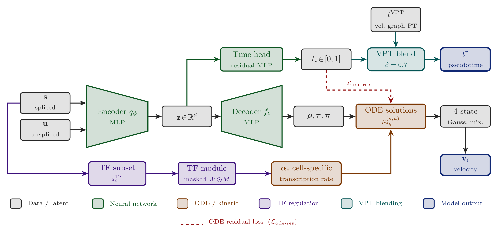

# TARVI

**Transcription-Factor Aided RNA Velocity Inference** — a deep generative (VAE)
extension of VeloVI with cell-specific TF-regulated transcription rates
(ChEA/ENCODE), a supervised residual latent-time head, a velocity–time
consistency loss, and velocity–pseudotime blending for calibrated cell-fate
trajectories from scRNA-seq.

---

<p align="center">
  
</p>

<p align="center"><em>TARVI architecture — the VeloVI VAE backbone augmented with a
TF-regulated transcription rate, a supervised residual latent-time head, ODE-aligned
auxiliary losses, and a velocity–pseudotime blend.</em></p>

> 🏆 **Best Paper Award** — *Biomedical Engineering and Instrumentation* track,
> MERCon 2026 (Moratuwa Engineering Research Conference, IEEE), University of
> Moratuwa, Sri Lanka, 13–14 August 2026.
> ([certificate](docs/assets/mercon_certificate.jpg))

## Overview

RNA velocity infers cellular dynamics from the ratio of unspliced to spliced
mRNA, but contemporary estimators share three structural limitations that TARVI
targets directly:

1. **Static transcription rates.** The per-gene rate `α_g` is a constant that
   ignores cell-state-dependent regulation. TARVI computes a **cell-specific
   `α_i`** from a masked, learnable transcription-factor → gene weight matrix
   built from ENCODE ChIP-seq and ChEA TF–target priors.
2. **Weakly-supervised latent time.** TARVI adds a **supervised residual
   time head** (trained against a stop-gradient ODE-time signal) with a
   graph-Laplacian temporal-smoothness regulariser and a **velocity–time
   consistency loss** that penalises velocities pointing from later to earlier
   cells.
3. **Local/global trajectory mismatch.** A post-hoc **velocity–pseudotime (VPT)
   blending** step fuses the learned time head with diffusion pseudotime on the
   velocity transition graph for a globally grounded temporal coordinate.

The model is built on the VeloVI four-state (induction / induction-steady /
repression / repression-steady) generative backbone.

Across five biologically diverse datasets and four baselines (Velocyto, scVelo
dynamical, VeloVI, TFvelo) evaluated with eight metrics, TARVI matches the
strongest baseline on cross-boundary direction accuracy and improves Spearman
pseudotime correlation by 126% over VeloVI (see [Results](#results)).

## Repository structure

```
TARVI/
├── tarvi/                     # core model package
│   ├── _model.py             # TARVI model class (scvi-tools BaseModelClass)
│   ├── _module.py            # TARVIVAE generative module + decoder
│   ├── _tf_module.py         # TF-regulated transcription rate + build_tf_mask
│   ├── _gnn.py               # graph refinement utilities
│   ├── _distributions.py     # custom distributions
│   ├── _utils.py             # preprocessing (preprocess_data)
│   └── _constants.py
├── evaluation/                # benchmarking metrics (ICCoH, CBDir, pseudotime, …)
│   └── metrics.py
├── scripts/                   # training / benchmark / figures
│   ├── train.py             # train one TARVI model (modes: baseline|tf|tf_nb|full)
│   ├── run_benchmark.py     # TARVI + all baselines × all 8 metrics on one dataset
│   └── plot_radar.py        # cross-dataset radar figure (Fig. 2)
├── paper/                     # compiled manuscript + README with abstract
│   ├── TARVI__Transcription_Factor_Aided_RNA_Velocity_Inference.pdf
│   └── README.md
├── supplementary/             # component ablation, background theory, scope (PDF + .tex)
├── notes/                     # extended methodology notes (PDF + .tex)
├── slides/                    # presentation slides
├── docs/                      # GitHub Pages site + architecture / radar / award assets
├── CITATION.cff
├── environment.yml
├── pyproject.toml
└── LICENSE
```

## Installation

```bash
conda env create -f environment.yml
conda activate tarvi
pip install -e .
```

The environment pins PyTorch 2.10 with CUDA 12.8; adjust the `torch` wheel index
in `environment.yml` for your CUDA version.

## Data

- **Paper benchmark datasets (5).** `pancreas` (endocrinogenesis), `bonemarrow`
  (haematopoiesis), `forebrain` (neuronal lineages), `chromaffin` (sympathetic
  nervous system) and `sceu_organoid` (metabolic labelling) — see Table I of the
  paper for sources. `pancreas`, `forebrain` and `bonemarrow` download
  automatically via `scvelo.datasets`; `chromaffin` and `sceu_organoid` (and
  other extras such as `dentategyrus`) should be placed under `./data/`.
- **TF–target databases.** The TF-regulation module needs the ENCODE and ChEA
  TF–target files (the same Enrichr / ChEA 2016 + ENCODE resources used by
  TFvelo). Place them under `./data/TFvelo/` (with `ENCODE/` and `ChEA/`
  subfolders) and pass the directory via `--tf_data_dir` (or the `tf_data_dir=`
  argument).

> `data/` is git-ignored; datasets are public and downloaded/placed locally.

## Quick start (Python API)

```python
import scvelo as scv
from tarvi import TARVI, preprocess_data

adata = scv.datasets.pancreas()
adata = preprocess_data(adata)                  # QC, moments, MinMax scaling, r² gene filter

TARVI.setup_anndata(adata, spliced_layer="Ms", unspliced_layer="Mu")
model = TARVI(
    adata,
    n_latent=10,
    use_tf_regulation=True,                     # cell-specific TF-regulated α_i
    tf_data_dir="./data/TFvelo",                # ENCODE + ChEA TF–target priors
)
model.train(max_epochs=500, accelerator="gpu", devices=[0])

adata.layers["velocity"] = model.get_velocity(n_samples=25, smooth=True).values
adata.obs["latent_time"] = model.get_latent_time(n_samples=25).mean(axis=1)
adata.obsm["X_tarvi"]    = model.get_latent_representation()
```

## Reproducing the paper

```bash
# 1) Train a single TARVI model  (modes: baseline | tf | tf_nb | full)
python scripts/train.py --dataset pancreas --mode full \
    --tf_data_dir ./data/TFvelo --log outputs/pancreas_full.log

# 2) Full benchmark on one dataset (TARVI + all baselines, all 8 metrics)
python scripts/run_benchmark.py --dataset pancreas \
    --tf_data_dir ./data/TFvelo --log outputs/bench_pancreas.log
#    repeat for: bonemarrow  forebrain  chromaffin  sceu_organoid

# 3) Cross-dataset radar figure (Fig. 2)
python scripts/plot_radar.py
```

The component ablation (TF / VTC / VPT blending across all five datasets) is
reported in [`supplementary/supplementary_material.pdf`](supplementary/supplementary_material.pdf)
(LaTeX source: `supplementary/supplementary_material.tex`).

Use `--help` on any script for the full option list.

## Results

Cross-dataset means over the five benchmarks (Table IV in the paper). Higher is
better for every metric; best value per column in **bold**; "–" marks undefined
or non-applicable entries.

| Method | ICCoH ↑ | CBDir ↑ | VelConf ↑ | PT-Spear ↑ | PT-DistCorr ↑ | PT-Cons ↑ | RootAcc ↑ | Gene-R²ₛₚₗ ↑ |
|--------|:------:|:------:|:--------:|:---------:|:------------:|:--------:|:--------:|:-----------:|
| **TARVI** | 0.776 | **0.933** | **0.927** | **0.747** | **0.771** | **0.986** | 0.671 | **0.477** |
| VeloVI | 0.787 | 0.931 | 0.920 | 0.331 | 0.341 | 0.904 | 0.723 | 0.443 |
| TFvelo | **0.933** | 0.569 | 0.915 | 0.397 | 0.412 | 0.794 | 0.655 | – |
| scVelo dynamical | – | – | – | 0.604 | 0.628 | 0.852 | **0.814** | – |
| Velocyto | 0.813 | 0.505 | 0.755 | 0.700 | 0.684 | 0.873 | 0.745 | – |

TARVI matches the strongest baseline on cross-boundary direction accuracy
(CBDir 0.933 vs. VeloVI 0.931) and leads on every temporal metric, improving
Spearman pseudotime correlation by **126%** over VeloVI (0.747 vs. 0.331).
TFvelo's high in-cluster coherence (ICCoH 0.933) comes with a large directional
cost (CBDir 0.569); scVelo dynamical's cosine metrics are undefined because its
per-gene EM produces NaN velocities for non-converging genes. RootAcc is
TARVI's weakest axis, driven almost entirely by bone marrow's multifurcating
haematopoietic topology.

See [`paper/`](paper/) and [`supplementary/`](supplementary/) for the full
per-dataset tables (Table III), all eight metrics, four baselines and the
component ablation.

## Paper & supplementary

- **Paper.** [`paper/TARVI__Transcription_Factor_Aided_RNA_Velocity_Inference.pdf`](paper/TARVI__Transcription_Factor_Aided_RNA_Velocity_Inference.pdf)
  — published at MERCon 2026 (IEEE), where it received the **Best Paper Award**
  in the Biomedical Engineering and Instrumentation track. [`paper/README.md`](paper/README.md)
  has the abstract and headline results.
- **Supplementary.** [`supplementary/supplementary_material.pdf`](supplementary/supplementary_material.pdf)
  (LaTeX source alongside) — the full component ablation, the background theory it
  relies on, and reproducibility/scope notes.
- **Methodology notes.** [`notes/TARVI_methodology_notes.pdf`](notes/TARVI_methodology_notes.pdf).
- **Slides.** [`slides/TARVI.pptx.pdf`](slides/TARVI.pptx.pdf).

## Citation

If you use TARVI, please cite the paper (see [`CITATION.cff`](CITATION.cff)):

```bibtex
@inproceedings{adhikari2026tarvi,
  title     = {TARVI: Transcription-Factor Aided RNA Velocity Inference with
               Supervised Latent Time and Velocity-Pseudotime Blending},
  author    = {Adhikari, Chandula and Dassanayake, Sandeep and Herath, Damayanthi},
  booktitle = {2026 Moratuwa Engineering Research Conference (MERCon)},
  year      = {2026},
  publisher = {IEEE},
  note      = {Best Paper Award, Biomedical Engineering and Instrumentation track}
}
```

## License

Released under the MIT License — see [`LICENSE`](LICENSE).

## Acknowledgements

TARVI builds on the VeloVI generative backbone (`scvi-tools`) and the
Scanpy/scVelo single-cell stack, and uses ENCODE and ChEA TF–target annotations
for the transcription-factor regulation module. We thank Prof. Mahesan Niranjan
(University of Southampton, UK) for guidance in conceptualising the work.
